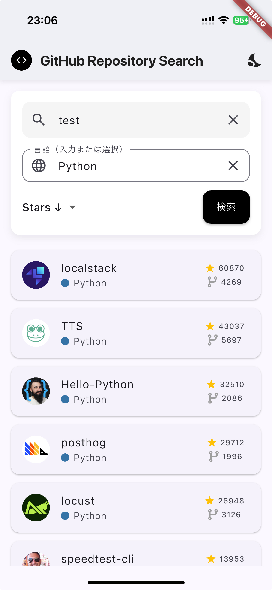
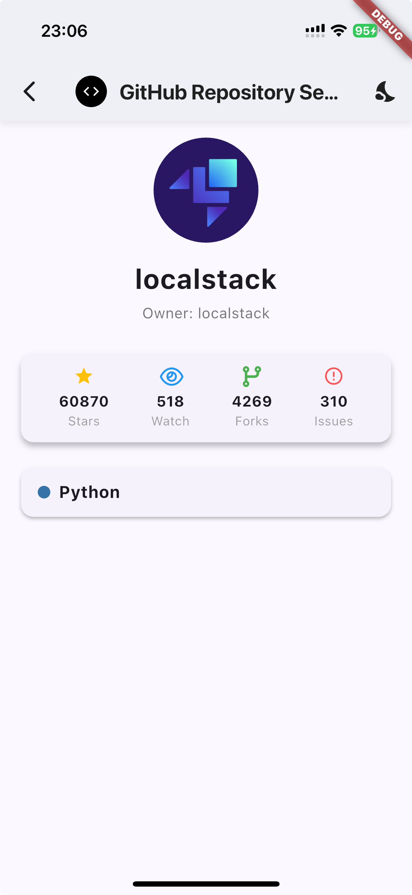

# Yumeimi GitHub Search

GitHub リポジトリをキーワード・言語・スター数で検索できる Flutter アプリです。  
Riverpod による状態管理と GitHub API 連携で、リアルタイムにリポジトリ情報を取得できます。

---

<p align="center">
  
  
</p>

---

## 主な機能

- キーワード検索
- プログラミング言語でフィルタリング
- スター数やフォーク数でソート
- 無限スクロール
- 検索結果 0 件時の案内表示
- 検索結果リポジトリ画面
- ダークモードの対応

---

## 開発環境

- Flutter 3.35.6
- Dart 3.9.2
- 対応 OS: iOS / Android

### 利用パッケージ

- `flutter_riverpod` … 状態管理
- `http` … HTTP リクエスト
- その他 UI 補助パッケージ（` font_awesome_flutter``flutter_launcher_icons  ` など）

---

## インストール・起動方法

```bash
git clone https://github.com/Sattsunn/yumemi_github_search
cd yumeimi_github_search
flutter pub get
flutter run
```

## 特徴・アピールポイント

モダンな状態管理: Riverpod と StateNotifier を用いたクリーンな設計

検索体験: キーワード・言語・ソート条件を反映

UI/UX への配慮: 検索結果 0 件時の案内表示やスクロールトップボタンなど操作性重視
